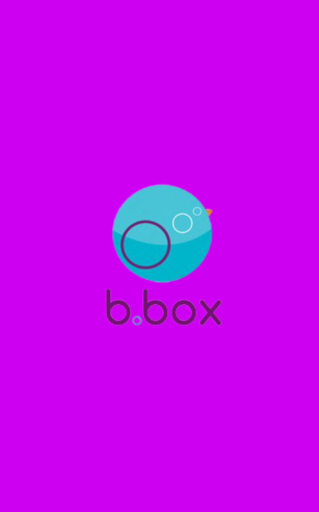
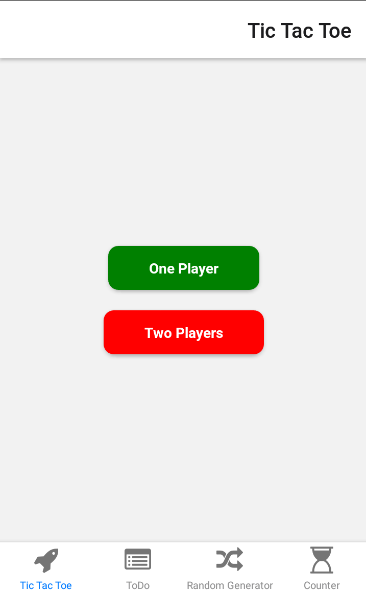
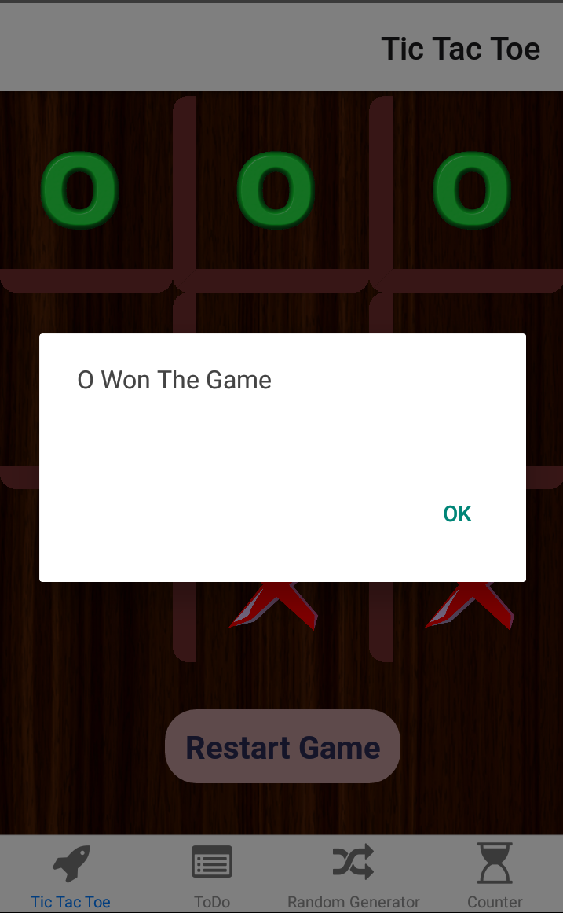
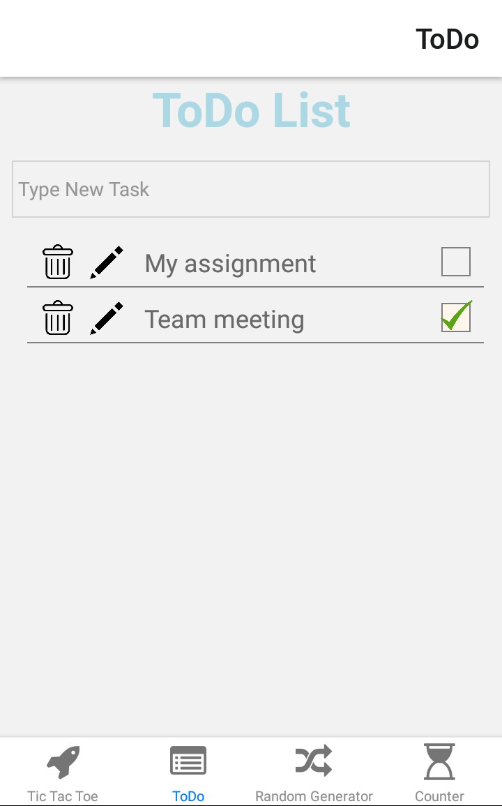
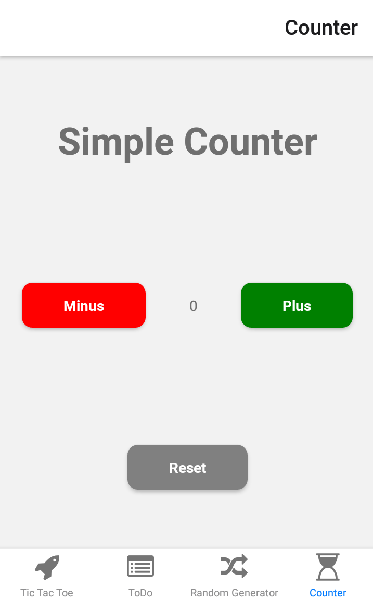
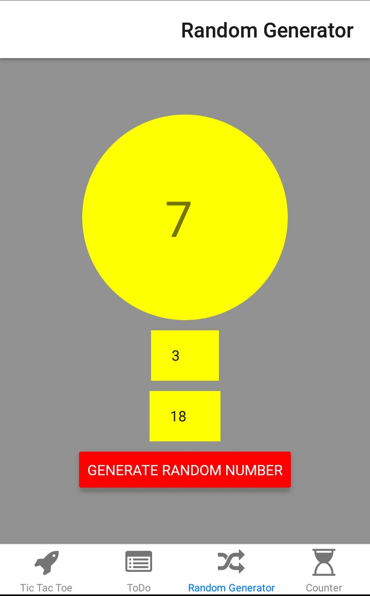

## B Box

A box app created with React Native.

Containes:
1) [Tic Tac Tok Game](Tic-Tac-Tok-Game)
2) [Todo List App](Todo-List-App)
3) [Simple Counter App](Simple-Counter-App)
4) [Random Number Generator App](Random-Number-Generator-App)

## Tic Tac Tok Game

Support Two Modes:
- Single Player(AI With Mini-Max Algorithm)
- Two Players

## Todo List App

Add any task. edit, remove tasks and mark them as completed

## Simple Counter App

## Random Number Generator App

Generate a random number within specific range of numbers

